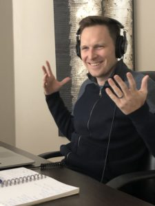

Adam Gordon Bell has spent 14+ years in the trenches as a software developer. He is fascinated by functional programming and using type systems to build better software.

He has is an advocate for distributed development teams and has worked remotely since 2011.

He has a [personal website here](http://adamgordonbell.com/) and can be found on twitter **[@adamgordonbell](https://twitter.com/adamgordonbell).**

He works for [Tenable](https://www.tenable.com/) currently and has worked at a variety of [**software producing companies**](https://www.linkedin.com/in/adamgordonbell/).

At Tenable he writes scala programs to tear docker containers apart and look for security vulnerabilities.  Working on security software is fun.

He lives in Peterborough, Ontario, Canada with his wife and three cats.
